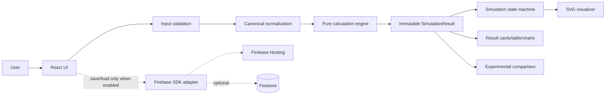

# ARCHITECTURE — BROWSER-FIRST V1

## 1. Decision

V1 is a static browser application deployed to Firebase Hosting. The scientific source of truth is the pure, deterministic calculation engine under `src/domain/calculation/`. There is no custom backend server or REST endpoint required for MVP calculation. This supersedes the earlier backend/API-authority wording in `ALGORITHM_SPEC.md`, `DATA_MODEL.md`, `PROJECT_RULES.md`, `PROJECT_SCOPE.md`, `ROADMAP.md` and `HANDOVER.md`.

This is a software architecture decision, not a scientific decision. Constant KD, temperature, reference data and validation thresholds remain governed by `EXPERT_DECISIONS.md`.

## 2. System diagram



Firebase is adjacent to the core path. A user can calculate, replay and inspect results with no network. Persistence cannot alter or recompute a snapshot.

## 3. Layer ownership

| Layer | Owns | Must not own |
|---|---|---|
| Presentation | labels, forms, focus, responsive layout, formatting, translated errors | CR/CE/recovery equations |
| Boundary validation | parse user text, check field contract, normalize units | changing scientific input silently |
| Domain models | stable TypeScript types and discriminated statuses | React state or Firestore SDK |
| Calculation | all stage arithmetic, invariants, chart arrays, visual plan | DOM, timers, database, clock, random |
| Visualization | deterministic SVG geometry, particles, labels | new scientific values |
| State machine | playback cursor/state transitions and controls | mutating `SimulationResult` |
| Persistence | serialize/restore saved snapshots and raw experiment records | running chemistry or overwriting raw data |
| Firebase Hosting | serve built static assets | calculation authority |

## 4. Data ownership and immutability

`SimulationInput` is editable. After normalization, `NormalizedSimulationInput` is frozen for one run. The engine returns a deep-readonly `SimulationResult`; the UI may hold a reference but never patch a stage. Animation stores only playback state (`currentStageIndex`, `phase`, `isPaused`, `speed`) and a reference to the result. Changing any input marks the displayed result stale and disables playback until a new run succeeds.

Saved scenario records contain the canonical input, complete result snapshot, engine version, reference/provenance and save metadata. A newer engine creates a new snapshot; it does not mutate the old result.

## 5. Source structure and responsibility

```text
src/
  app/                 app shell, providers and mode selection
  components/
    input/             InputPanel, split editor, error summary
    simulation/        Funnel workspace and playback controls
    results/           CurrentResult, final card, StageTable
    charts/            chart wrappers using result.chart arrays
    common/            buttons, cards, unit labels, status banners
  domain/
    models/            SimulationInput, StageResult, SimulationResult, validation types
    validation/        parse, unit conversion, field errors, provenance checks
    calculation/       calculateStage, calculateSimulation, invariant checks
    constants/         software-only limits/tolerance/particle count
  simulation/
    state-machine/     events, reducer, transition table, playback scheduler
    visualization/     fill and particle mappings, SVG geometry
  firebase/            optional save/load adapters and Firestore converters
  pages/               SingleSimulation, ScenarioComparison, Validation
  hooks/               useSimulationPlayback and UI-only hooks
  utils/               CSV parser, number display and a11y helpers
```

Tests live beside modules or in `tests/` according to `TECH_STACK.md`; they share fixtures but never import React into domain tests.

## 6. Run lifecycle

```text
EDITING
  -> validateInput(raw form)
  -> normalizeInput(raw form)
  -> calculateSimulation(normalized, engineVersion)
  -> assert invariants
  -> freeze result
  -> READY(result)
  -> playback state machine
```

Validation errors return field-level messages and no result. Calculation faults return a typed error and no playback. Warnings (for example `USER_SUPPLIED_KD`, pending temperature or missing domain note) travel with a valid result and appear in the UI.

## 7. Persistence boundary

MVP may keep the last result in memory. Firestore work starts only after `PERSIST-001` is accepted. The adapter must:

- use converters matching `DATA_MODEL.md`;
- save complete snapshots, never only a final number;
- retain engine/reference versions;
- append raw experiment observations;
- create correction/exclusion audit records;
- fail visibly without changing local calculation.

No Firebase call is made during stage animation or on every React render.

## 8. Security and privacy baseline

Do not place API secrets in the Vite bundle. Firestore rules are deny-by-default before any write feature is enabled. Experimental operator identity and raw titration data are minimized. A static teaching mode must be usable without login. Security review is a release gate for persistence, not a reason to add authentication to the calculation MVP.

## 9. Architecture acceptance criteria

- Domain engine imports in isolation with no DOM/Firebase/React.
- Browser calculation works with network disabled.
- UI has no duplicate chemistry formula path.
- Pause, speed and replay leave result JSON byte-equivalent.
- Firebase outage does not change a valid local result.
- `rg`/code review can identify every import from `src/firebase/` and every call to the engine.
