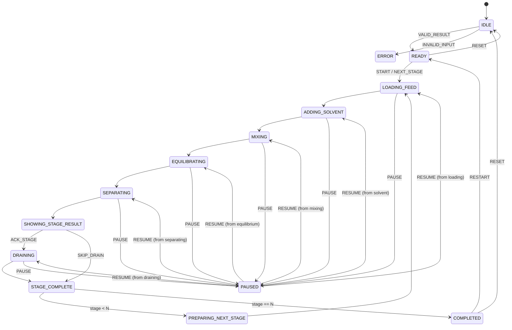

# SIMULATION STATE MACHINE

## Purpose

The reducer controls visual progression only. It receives a frozen `SimulationResult`; no event recalculates or mutates scientific values. State and events are serializable for tests.

## State vocabulary

| State | Entry condition | Visible UI/SVG | Data consumed | Allowed controls | Exit |
|---|---|---|---|---|---|
| `IDLE` | no result | empty funnel, instructions | none | Edit, Start | valid Start → READY; invalid → ERROR |
| `READY` | valid result, not playing | current/next stage, reset view | stage 0 or selected stage | Start, Restart, Reset, Next Stage | Start → LOADING_FEED |
| `LOADING_FEED` | stage selected | raffinate enters funnel | `nInputMol`, `VR`, prior `CR` | Pause, Reset | complete → ADDING_SOLVENT |
| `ADDING_SOLVENT` | feed loaded | fresh organic stream/label | `solventVolumeL` | Pause, Reset | complete → MIXING |
| `MIXING` | both phases loaded | symbolic mixing particles | no new values | Pause, Reset | complete → EQUILIBRATING |
| `EQUILIBRATING` | mixing complete | caption “equilibrium assumed” | `CR`, `CE`, fractions | Pause, Reset | complete → SEPARATING |
| `SEPARATING` | equilibrium visual done | two labelled phases | nominal volumes, fractions | Pause, Reset | complete → SHOWING_STAGE_RESULT |
| `SHOWING_STAGE_RESULT` | phases separated | current card, labels | full StageResult | Pause, Next Stage, Restart, Reset | acknowledge → DRAINING or STAGE_COMPLETE |
| `DRAINING` | collect extract | extract stream, raffinate retained | `nE`, `nR`, recovery | Pause, Reset | complete → STAGE_COMPLETE |
| `STAGE_COMPLETE` | stage committed | timeline marks complete, table row available | StageResult index | Next Stage, Restart, Reset | next → PREPARING_NEXT_STAGE; last → COMPLETED |
| `PREPARING_NEXT_STAGE` | prior stage complete | clear/retain raffinate for next stage | next stage input | Pause, Reset | complete → LOADING_FEED |
| `COMPLETED` | all N stages done | final card/table/charts unlocked | `final`, all arrays | Restart, Reset | Restart → READY; Reset → IDLE |
| `PAUSED` | pause from any animating state | freeze current frame + “paused” | same state snapshot | Resume, Next Stage, Restart, Reset | Resume → pausedFrom; Next → finish current stage |
| `ERROR` | invalid result/transition | error banner, no animation | typed error only | Edit, Retry, Reset | valid Start → READY; Reset → IDLE |

`READY` does not mean only stage 0: after a stage completes it may represent the next stage. `SHOWING_STAGE_RESULT` and `DRAINING` must not calculate anything.

## Diagram

## Events and transition rules

| Event | Guard | Effect |
|---|---|---|
| `CALCULATION_READY(result)` | schema valid, stages 0..N | replace old result, enter READY at stage 0 |
| `START` | READY and result current | stage cursor 1, enter LOADING_FEED |
| `PAUSE` | animating state | capture `pausedFrom`, freeze timer only |
| `RESUME` | PAUSED | restore exact `pausedFrom`, no result change |
| `NEXT_STAGE` | READY/SHOWING/PAUSED | finish substeps, commit exactly one next stage |
| `RESTART` | any valid result | keep input/result, playback from stage 0 |
| `RESET` | any | discard result/playback to IDLE; form reset is separate |
| `INPUT_CHANGED` | any | mark result stale, disable playback until recalculation |
| `CALCULATION_ERROR` | no valid result | enter ERROR and retain raw input |
| `SPEED_CHANGED` | 0.5/1/2 | duration multiplier only |

`Next Stage` completes all remaining substeps of the current stage without exposing an intermediate recalculation. `Start` computes before entering the state machine; it never starts a timer before result creation.

## One-stage choreography

1. `LOADING_FEED`: render prior aqueous amount/concentration and nominal aqueous volume.
2. `ADDING_SOLVENT`: render fresh solvent with zero incoming AcOH and indexed volume.
3. `MIXING`: animate symbolic contact; no scientific field changes.
4. `EQUILIBRATING`: show constant-KD assumption and stage `CR/CE`; no fitted value.
5. `SEPARATING`: display conventional aqueous/organic layers and labels.
6. `SHOWING_STAGE_RESULT`: bind cards directly to the indexed StageResult.
7. `DRAINING`: show extract collected and raffinate retained; use `nE/nR` labels.
8. `STAGE_COMPLETE`: update timeline/table/chart cursor from that same StageResult.
9. `PREPARING_NEXT_STAGE`: retain raffinate visually and select next indexed record.

## Control semantics

- `Start`: validate → normalize → calculate all → freeze → initialize playback.
- `Pause`/`Resume`: timer/progress only; result byte-equivalence required.
- `Next Stage`: no recalculation; one stage advancement.
- `Restart`: keep current valid input/result, playback from stage 0.
- `Reset`: clear result/playback to IDLE; raw form reset is a separate explicit UI action.
- Speed controls alter duration, never values or order.

## Testable reducer invariants

- No state except `CALCULATION_READY` can replace the result reference.
- All `stages` exist before START.
- Stage cursor remains in `[0,N]`.
- Pause/resume/restart/speed do not mutate JSON snapshot.
- Invalid/missing stage fields enter ERROR and cannot animate.
- `C0=0` still visits every stage but renders zero particles.
